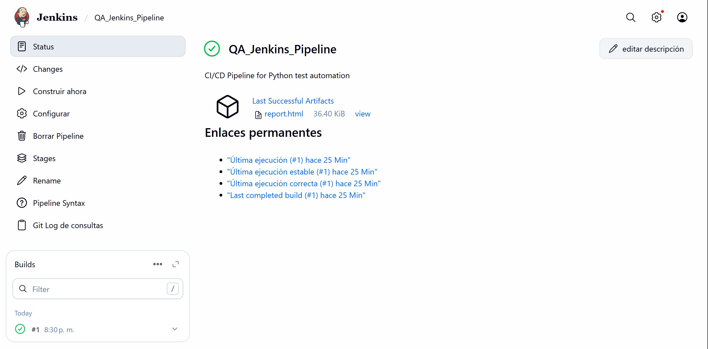
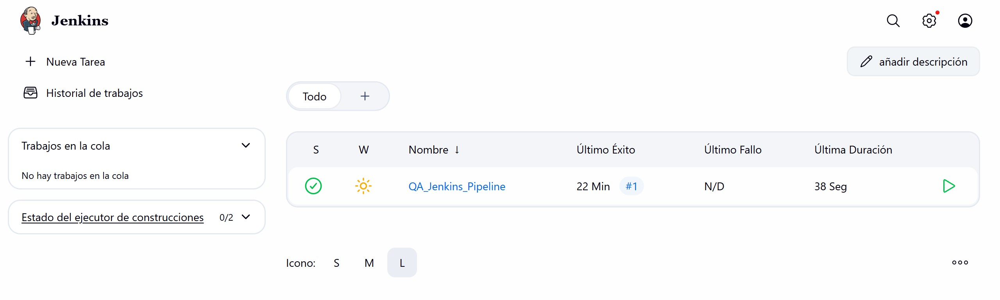

# QA Jenkins CI/CD Pipeline


Professional CI/CD automation pipeline using Jenkins and Python pytest for automated testing.

## Project Overview

Complete Jenkins CI/CD pipeline demonstrating automated testing workflow with Python. The pipeline automatically clones code from GitHub, installs dependencies, runs tests, and generates HTML reports.

## Features

- Automated CI/CD pipeline with Jenkins
- Python pytest integration
- HTML test reports generation
- Docker containerization
- GitHub integration with SCM polling
- 8 automated test cases (100% passing)
- Professional pipeline stages

## Tech Stack

- **CI/CD:** Jenkins 2.528.3 (Docker)
- **Testing:** Python 3.13 + Pytest 7.4.3
- **Reporting:** pytest-html 4.1.1
- **Version Control:** Git + GitHub
- **Containerization:** Docker Compose

## Project Structure
```
QA_Jenkins_CICD/
├── tests/
│   └── test_sample.py          # 8 automated tests
├── docs/
│   └── images/                 # Documentation screenshots
├── reports/                    # Generated HTML reports
├── Jenkinsfile                 # Pipeline configuration
├── docker-compose.yml          # Jenkins setup
├── requirements.txt            # Python dependencies
├── pytest.ini                  # Pytest configuration
├── .gitignore
└── README.md
```

## Installation

### Prerequisites

- Docker Desktop installed
- Git installed
- GitHub account

### Setup Jenkins
```bash
# Clone repository
git clone https://github.com/arturdmt-alt/QA_Jenkins_CICD.git
cd QA_Jenkins_CICD

# Start Jenkins container
docker-compose up -d

# Access Jenkins
# Navigate to: http://localhost:8080
```

### Initial Jenkins Setup

1. Get initial admin password:
```bash
docker exec jenkins-cicd cat /var/jenkins_home/secrets/initialAdminPassword
```

2. Install suggested plugins

3. Create admin user

### Install Python in Jenkins Container
```bash
docker exec -u root jenkins-cicd apt-get update
docker exec -u root jenkins-cicd apt-get install -y python3 python3-pip
docker exec jenkins-cicd python3 --version
```

## Pipeline Configuration

### Create New Pipeline

1. **Jenkins Dashboard** → **New Item**
2. **Name:** `QA_Jenkins_Pipeline`
3. **Type:** Pipeline
4. **Pipeline Definition:** Pipeline script from SCM
5. **SCM:** Git
6. **Repository URL:** `https://github.com/arturdmt-alt/QA_Jenkins_CICD.git`
7. **Branch:** `*/main`
8. **Script Path:** `Jenkinsfile`

### Pipeline Stages
```groovy
1. Checkout         - Clone repository from GitHub
2. Setup Python     - Verify Python installation
3. Install Dependencies - Install pytest and requirements
4. Run Tests        - Execute 8 automated tests
5. Archive Results  - Save HTML reports
```

## Running the Pipeline

### Manual Execution
```
Jenkins Dashboard → QA_Jenkins_Pipeline → Build Now
```

### Automatic Execution

Pipeline runs automatically when:
- Code is pushed to GitHub (with SCM polling)
- Manual trigger via "Build Now"

## Test Results

The Jenkins pipeline was executed successfully, running all automated tests using pytest.

**Execution summary:**
- Pipeline status: SUCCESS
- Total tests executed: 8
- Result: 100% passing
- Execution time: ~38 seconds

### Jenkins Dashboard

Overview of the Jenkins dashboard showing the pipeline status and build history:



### Pipeline Execution Details

Detailed view of the pipeline execution, including generated artifacts such as the HTML test report:



The HTML test report (`report.html`) is automatically generated and archived as a Jenkins artifact, allowing easy access to detailed test results after each build.

## Screenshots

### Jenkins Pipeline Dashboard

*Successful pipeline execution with archived HTML report*

### Build Success

*Pipeline #1 completed successfully in 38 seconds*

## Jenkinsfile
```groovy
pipeline {
    agent any
    
    stages {
        stage('Checkout') {
            steps {
                checkout scm
            }
        }
        
        stage('Setup Python') {
            steps {
                sh 'python3 --version'
                sh 'pip3 --version'
            }
        }
        
        stage('Install Dependencies') {
            steps {
                sh 'pip3 install --break-system-packages -r requirements.txt'
            }
        }
        
        stage('Run Tests') {
            steps {
                sh 'python3 -m pytest tests/ -v --html=reports/report.html --self-contained-html'
            }
        }
        
        stage('Archive Results') {
            steps {
                archiveArtifacts artifacts: 'reports/*.html', allowEmptyArchive: true
            }
        }
    }
    
    post {
        always {
            echo 'Pipeline execution completed!'
        }
        success {
            echo 'All tests passed successfully!'
        }
        failure {
            echo 'Tests failed. Check the reports.'
        }
    }
}
```

## Docker Configuration

**docker-compose.yml:**
```yaml
services:
  jenkins:
    image: jenkins/jenkins:lts
    container_name: jenkins-cicd
    privileged: true
    user: root
    ports:
      - "8080:8080"
      - "50000:50000"
    volumes:
      - ./jenkins_home:/var/jenkins_home
      - /var/run/docker.sock:/var/run/docker.sock
```

## Key Learning Outcomes

- Jenkins pipeline creation and configuration
- CI/CD automation workflow
- Docker containerization for CI/CD
- GitHub integration with Jenkins
- Python test automation with pytest
- Artifact archiving and reporting
- Pipeline as Code (Jenkinsfile)
- SCM polling and webhooks

## Troubleshooting

### Common Issues

**Python not found:**
```bash
docker exec -u root jenkins-cicd apt-get install -y python3 python3-pip
```

**Permission errors:**
```bash
pip3 install --break-system-packages -r requirements.txt
```

**Container not starting:**
```bash
docker-compose down
docker-compose up -d
```

## Stopping Jenkins
```bash
# Stop and remove containers
docker-compose down

# Stop without removing
docker-compose stop
```

## Author

**Artur Dmytriyev**

- GitHub: [@arturdmt-alt](https://github.com/arturdmt-alt)
- LinkedIn: [Artur Dmytriyev](https://www.linkedin.com/in/arturdmytriyev)

